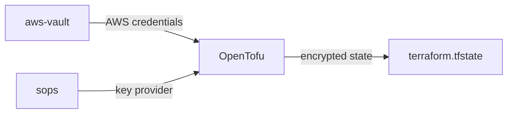

# homelab-terraform-bootstrap

Set up remote state management with [nozaq/terraform-aws-remote-state-s3-backend](https://github.com/nozaq/terraform-aws-remote-state-s3-backend).

Note: this module use local backend and state encryption provided by OpenTofu,
which lead to the following restrictions.

1. It's incompatible with Terraform.
2. It cannot be run concurrently or managed by CD.

## Prerequisites

- OpenTofu ~> 1.7
- sops
- AWS configured with aws-vault

### Workflow



## Guide

### Configure AWS

Enable AWS IAM Identity Center, configure user access for it, setup
CLI configuration file, and login with aws-vault.

1. [Enabling AWS IAM Identity Center - AWS IAM Identity Center](https://docs.aws.amazon.com/singlesignon/latest/userguide/get-set-up-for-idc.html)
2. [Configure user access with the default IAM Identity Center directory - AWS IAM Identity Center](https://docs.aws.amazon.com/singlesignon/latest/userguide/quick-start-default-idc.html)
3. [Configure the AWS CLI to use IAM Identity Center token provider credentials with automatic authentication refresh - AWS Command Line Interface](https://docs.aws.amazon.com/cli/latest/userguide/sso-configure-profile-token.html)
4. _Quick start_ in [aws-vault/README.md at master · 99designs/aws-vault](https://github.com/99designs/aws-vault/blob/master/README.md#quick-start)
5. `aws-vault exec admin -- aws account enable-region --region-name ap-east-1`

Note: it's unnecessary to login using AWS CLI. Use aws-vault instead.
The configuration in step 3 should be like this.

```ini
[profile admin]
sso_session = szpio
sso_account_id = 123456789011
sso_role_name = AdministratorAccess
region = ap-southeast-1

[profile terraform]
sso_session = szpio
sso_account_id = 137927498482
sso_role_name = TerraformUser
region = ap-east-1

[sso-session szpio]
sso_start_url = https://szpio.awsapps.com/start
sso_region = ap-southeast-1
sso_registration_scopes = sso:account:access
```

The `terraform` profile will be valid after this module is applied.
