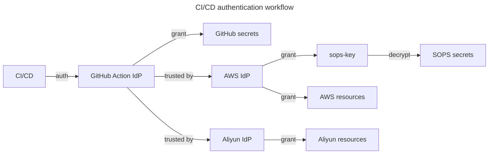

# homelab-terraform-github-action

Set up CI/CD environment for GitHub Action. This module is managed by Admin.

## Guide

### Workflow



We leverage OIDC trust to grant access to secrets and resources to GitHub Actions.

### Apply

```shell
ALICLOUD_PROFILE=default aws-vault exec admin -- terragrunt apply
```

Update `.sops.yaml` to include `aws_sops_key_arn`.

```diff
@@ -1,11 +1,7 @@
 keys:
+  - &github_action
+    arn: arn:aws:kms:ap-southeast-1:123456789011:key/alias/sops-key
 creation_rules:
   - path_regex: ^secrets/terraform/
     key_groups:
+      - kms:
+          - *github_action
```

Re-encrypt the secrets.

```shell
aws-vault exec admin -- sops updatekeys secrets/terraform/tofu-encryption.json
```

## Considerations

### Credential Management

Here are some similar concepts between Aliyun and AWS.

| Aliyun   | Similar AWS          |
| -------- | -------------------- |
| RAM      | IAM                  |
| CloudSSO | IAM Identity Center  |
| [SSO]    | [Identity providers] |

[sso]: https://www.alibabacloud.com/help/en/ram/user-guide/sso-overview
[Identity providers]: https://docs.aws.amazon.com/IAM/latest/UserGuide/id_roles_providers.html

I considered the following 3 ways to manage Aliyun credentials.

- **CloudSSO**: Aliyun CloudSSO requires a corporation account to use. It's
  difficult for me to set up.
- **SSO**: It's hard to find a suitable identity provider. GitHub and
  IAM Identity Center don't issue ID tokens [^1][^2].
- **Long-lived access token**: It's insecure and not recommended.

[^1]:
    [GitHub Apps overview - GitHub Docs](https://docs.github.com/en/apps/overview)
    GitHub only provides OAuth access tokens, not ID tokens specified in OIDC.
    GitHub does offer an OIDC issuer for GitHub Action, and it's not accessible
    from other environments.

[^2]:
    [CreateToken - AWS IAM Identity Center](https://docs.aws.amazon.com/singlesignon/latest/OIDCAPIReference/API_CreateToken.html#API_CreateToken_ResponseSyntax)
    ID Token is not implemented. AWS does have Cognito, which is a full-featured
    OIDC provider, but it's for end-users.

I choose the long-lived access token to bootstrap Aliyun resources. Once my own
identity provider is ready, I will switch to the SSO method for better security.
